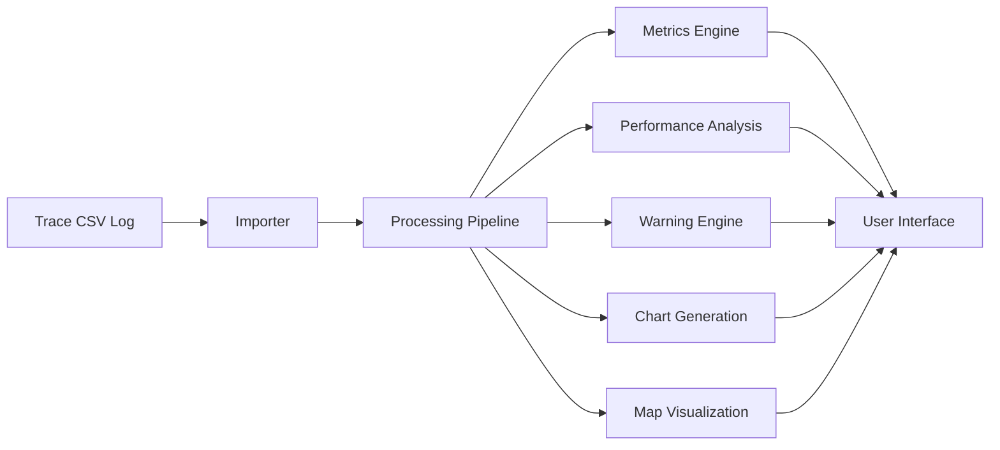
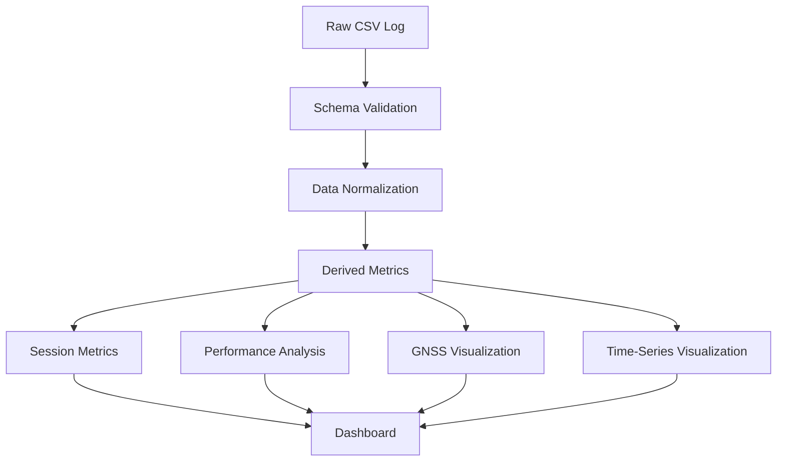

# 🏁 Trace Studio

> Telemetry analysis platform for Trace vehicle logs.

[](https://www.python.org/)
[](https://streamlit.io/)
[](https://plotly.com/)
[](https://python-visualization.github.io/folium/)
[](LICENSE)

Trace Studio is a Python-based telemetry analysis platform designed to explore, validate, visualize, and analyze sessions recorded by the Trace embedded data logger.

The application transforms raw telemetry logs into interactive dashboards, synchronized time-series visualizations, geographic views, and performance metrics, allowing users to investigate vehicle behaviour through a unified analysis workflow.

Unlike traditional spreadsheet-based workflows, Trace Studio provides a structured telemetry pipeline with validation, derived metrics, quality assessment, and interactive exploration tools.

---

## Trace Ecosystem

**Trace Ecosystem** is a complete telemetry platform designed for the acquisition, synchronization, storage, and analysis of automotive data.

The ecosystem consists of two complementary projects:

### Trace

An ESP32-S3-based embedded data logger that acquires and synchronizes data from GNSS, IMU, and vehicle networks (OBD2/CAN), storing telemetry locally on a microSD card while providing configuration and monitoring through a built-in web interface.

### Trace Studio

A Python-based telemetry analysis platform that processes and visualizes sessions recorded by Trace. It provides interactive dashboards, synchronized time-series plots, GNSS map visualization, performance analysis, and data-quality validation tools.

### Goal

The goal of the project is to provide a fully self-contained solution for collecting, exploring, and understanding vehicle telemetry, covering the entire workflow from data acquisition on the vehicle to post-session analysis and visualization.

### Repositories

* **[Trace](https://github.com/mdmmt05/Trace)** — Embedded Data Logger
* **[Trace Studio](https://github.com/mdmmt05/Trace-Studio)** — Telemetry Analysis Platform

---

## Project Overview

Trace Studio was developed as the analysis component of the Trace Ecosystem.

Its primary purpose is to transform raw telemetry collected in the vehicle into actionable information through a repeatable and transparent processing pipeline.

The platform performs four main tasks:

1. Validate telemetry logs and identify potential data quality issues.
2. Normalize and enrich raw sensor data through derived metrics.
3. Provide interactive visualization tools for exploratory analysis.
4. Generate performance-oriented metrics from recorded sessions.

The architecture emphasizes:

* Reproducibility.
* Data transparency.
* Extensibility.
* Offline-first operation.
* Human-centered analysis workflows.

All processing is performed locally. No cloud services, external databases, or proprietary backends are required.

---

## Software Architecture

Trace Studio follows a pipeline-oriented architecture in which telemetry data is progressively validated, normalized, enriched, analyzed, and visualized.

### Processing Pipeline



The architecture separates data ingestion, transformation, analysis, and visualization into independent modules, improving maintainability and enabling future expansion.

### Data Flow



Every analysis begins with schema validation and normalization, ensuring that all downstream calculations operate on a consistent and predictable dataset.

This approach makes Trace Studio robust against malformed logs and simplifies future integration of additional telemetry sources.

### Project Structure

```text
trace_studio/
│
├── app.py
│
├── config.py
├── schema.py
│
├── importer.py
├── processing.py
├── metrics.py
├── performance.py
├── warnings.py
│
├── charts.py
├── map_view.py
├── cursor.py
│
├── ui.py
├── theme.py
│
└── __init__.py
```

### Module Responsibilities

| Module           | Responsibility                          |
| ---------------- | --------------------------------------- |
| `importer.py`    | CSV loading and validation              |
| `processing.py`  | Data normalization and derived channels |
| `metrics.py`     | Session statistics and summary metrics  |
| `performance.py` | Performance-oriented analysis           |
| `warnings.py`    | Automatic quality assessment            |
| `charts.py`      | Time-series visualizations              |
| `map_view.py`    | GNSS-based geographic visualization     |
| `cursor.py`      | Shared temporal cursor management       |
| `ui.py`          | User interface composition              |
| `theme.py`       | Styling and presentation layer          |

---

## Features

### Session Overview Dashboard

Trace Studio automatically generates a high-level summary of each telemetry session, providing immediate visibility into the most relevant indicators.

Available metrics include:

* Session duration
* Number of samples
* Distance travelled
* Maximum vehicle speed
* Maximum engine RPM
* Peak longitudinal acceleration
* Peak lateral acceleration
* Altitude statistics
* Estimated gear usage

The dashboard also includes a technical warning panel highlighting potential issues in the recorded telemetry.

---

### Data Quality Assessment

Before analysis, Trace Studio evaluates the quality of the imported dataset and automatically reports anomalies.

Examples include:

* Missing data.
* Invalid timestamps.
* GNSS coverage issues.
* Synchronization degradation.
* Sampling gaps.
* Sensor availability problems.

This allows users to assess the reliability of a session before drawing conclusions from the data.

---

### Synchronized Time-Series Analysis

Telemetry channels can be visualized through synchronized interactive plots sharing a common time axis.

Supported channels include:

* Vehicle speed
* Engine RPM
* Throttle position
* Longitudinal acceleration
* Lateral acceleration
* Roll
* Pitch
* Slope
* Heading
* Yaw rate
* Jerk
* Curvature
* Estimated gear

Features:

* Shared zoom and pan.
* Unified hover mode.
* Multi-channel comparison.
* Interactive time cursor.
* Automatic synchronization across all visualizations.

This makes it possible to correlate vehicle behaviour across multiple subsystems at a specific instant in time.

---

### Interactive GNSS Visualization

Trace Studio provides an interactive geographic representation of the recorded route using OpenStreetMap.

Capabilities include:

* Raw GNSS route visualization.
* Color-coded telemetry overlays.
* Start and end markers.
* Interactive route exploration.
* Cursor synchronization with time-series charts.
* Automatic downsampling for large datasets.

Route segments can be coloured using:

* Vehicle speed
* RPM
* Throttle position
* Longitudinal acceleration
* Lateral acceleration
* Slope
* Jerk
* Curvature
* Estimated gear

This enables rapid spatial interpretation of vehicle behaviour.

---

### Performance Analysis

Trace Studio includes dedicated tools for extracting performance-oriented metrics from recorded sessions.

Current analyses include:

#### Acceleration Metrics

* 0–50 km/h
* 0–100 km/h
* 80–120 km/h

The fastest valid event within the session is automatically identified.

#### Braking Analysis

* Maximum deceleration
* Peak braking location
* Vehicle speed at peak braking

#### Lateral Dynamics

* Peak lateral acceleration
* Cornering load estimation

#### Threshold Analysis

Time spent above configurable thresholds for:

* RPM
* Throttle position
* Lateral acceleration

#### Friction Circle

Interactive friction-circle visualization displaying:

* Longitudinal acceleration
* Lateral acceleration
* Vehicle speed colouring
* Reference circles

This view provides an intuitive representation of combined vehicle loading.

---

### Derived Telemetry Channels

Trace Studio enriches raw telemetry through a dedicated processing pipeline.

Derived channels currently include:

| Channel          | Description                        |
| ---------------- | ---------------------------------- |
| `time_s`         | Session-relative time              |
| `speed_mps`      | Speed in SI units                  |
| `distance_m`     | Canonical travelled distance       |
| `distance_km`    | Travelled distance in kilometres   |
| `sample_dt_s`    | Sampling interval                  |
| `acc_lon_mps2`   | Longitudinal acceleration          |
| `acc_lat_mps2`   | Lateral acceleration               |
| `acc_lon_G_filt` | Filtered longitudinal acceleration |
| `acc_lat_G_filt` | Filtered lateral acceleration      |
| `jerk_lon_mps3`  | Longitudinal jerk                  |
| `jerk_lat_mps3`  | Lateral jerk                       |
| `curvature_1pm`  | Path curvature                     |
| `curve_radius_m` | Estimated curve radius             |

The goal is to transform raw sensor values into quantities that are easier to interpret and analyse.

---

### Data Exploration Tools

Trace Studio includes several utilities for inspecting the dataset directly.

Available tools:

* Raw data preview.
* Processed data preview.
* Column catalogue.
* Unit reference.
* Type inspection.
* Session diagnostics.

These tools are particularly useful when developing new firmware features or validating telemetry pipelines.

---

### Debug & Validation

A dedicated debug section exposes internal information generated during processing.

Examples include:

* Validation reports.
* Session statistics.
* Warning summaries.
* Column types.
* Processing diagnostics.

This functionality is intended primarily for development, testing, and telemetry pipeline validation.

---

## Design Principles

### Offline First

All processing occurs locally on the user's machine.

No cloud services or remote APIs are required.

### Transparency

Every transformation applied to telemetry data is explicit and reproducible.

### Reproducibility

The same input dataset always generates the same derived metrics and analyses.

### Extensibility

The architecture allows new channels, analyses, visualizations, and data sources to be integrated with minimal impact on existing modules.

### Analysis-Oriented Design

The platform prioritizes understanding and exploration of telemetry data rather than simple visualization.

---

## Requirements

### Runtime Requirements

* Python 3.11+
* Modern web browser
* Internet connection (required only for OpenStreetMap tile loading)

---

### Python Dependencies

| Package            | Purpose                      |
| ------------------ | ---------------------------- |
| `streamlit`        | User interface framework     |
| `pandas`           | Data manipulation            |
| `numpy`            | Numerical computations       |
| `plotly`           | Interactive visualizations   |
| `folium`           | Geographic visualization     |
| `streamlit-folium` | Streamlit/Folium integration |
| `branca`           | Colormap generation          |

All dependencies are listed in `requirements.txt`.

---

## Installation

### Clone Repository

```bash
git clone https://github.com/mdmmt05/Trace-Studio.git
cd Trace-Studio
```

### Create Virtual Environment

```bash
python -m venv .venv
```

### Activate Environment

**Windows (PowerShell)**

```powershell
.venv\Scripts\Activate.ps1
```

**Windows (Command Prompt)**

```cmd
.venv\Scripts\activate.bat
```

**Linux / macOS**

```bash
source .venv/bin/activate
```

### Install Dependencies

```bash
pip install -r requirements.txt
```

---

## Launching Trace Studio

Start the application with:

```bash
streamlit run app.py
```

Once launched, Streamlit will automatically open a browser window.

By default the application is available at:

```text
http://localhost:8501
```

---

## Workflow

The recommended workflow is:

```text
Vehicle
    ↓
Trace
    ↓
CSV Log
    ↓
Trace Studio
    ↓
Validation
    ↓
Processing
    ↓
Analysis
    ↓
Visualization
```

A typical analysis session consists of:

1. Importing a CSV log generated by Trace.
2. Validating the telemetry structure.
3. Generating derived metrics.
4. Exploring charts and maps.
5. Reviewing performance indicators.
6. Investigating anomalies or interesting events.

---

## Expected CSV Format

Trace Studio is designed to work with logs generated by Trace.

The minimum supported schema includes:

| Category        | Examples                             |
| --------------- | ------------------------------------ |
| GNSS            | Latitude, longitude, altitude, HDOP  |
| IMU             | Accelerations, roll, pitch, slope    |
| OBD2            | RPM, speed, throttle, engine load    |
| Synchronization | Monotonic timestamps, UTC timestamps |
| Quality Metrics | Sensor age, sync quality             |

Additional columns are preserved whenever possible.

The processing pipeline validates incoming data before analysis begins.

---

## Processing Pipeline

The telemetry processing pipeline performs several transformations before analysis:

### Validation

* Schema validation.
* Missing-column detection.
* Type verification.

### Normalization

* Unit conversions.
* Timestamp normalization.
* Distance estimation.

### Enrichment

Generation of derived telemetry channels such as:

* Distance travelled.
* Filtered acceleration.
* Jerk.
* Curvature.
* Curve radius.

### Analysis

Computation of:

* Session metrics.
* Performance indicators.
* Data quality indicators.

### Visualization

Generation of:

* Dashboards.
* Time-series charts.
* Interactive maps.
* Friction-circle plots.

---

## Testing

Run the automated test suite with:

```bash
python -m pytest tests/ -v
```

The tests primarily focus on:

* CSV validation.
* Data normalization.
* Metric generation.
* Processing pipeline correctness.

---

## Known Limitations

Current limitations include:

### Mapping

* No map matching.
* Raw GNSS coordinates only.
* Dependence on OpenStreetMap tile availability.

### Distance Estimation

* OBD-based distance uses numerical integration.
* GNSS-based distance uses a Haversine approximation.

### Session Management

* Single-session analysis only.
* No persistent session database.

### Reporting

* No PDF export.
* No automated report generation.

These limitations are actively considered for future development.

---

## Roadmap

### Completed

* CSV validation
* Data normalization
* Interactive dashboard
* Synchronized charts
* Interactive GNSS map
* Shared time cursor
* Derived telemetry channels
* Session diagnostics
* Performance analysis
* Friction circle visualization

---

### Planned

#### Analysis

* Multi-session comparison
* Session-to-session overlays
* Lap segmentation
* Advanced statistical summaries

#### Mapping

* Map matching
* Route reconstruction
* Segment classification

#### Reporting

* PDF report generation
* Exportable analysis summaries
* Snapshot generation

#### Data Management

* Local session database
* Session tagging
* Session search and filtering

#### Ecosystem Integration

* Direct Trace log import
* Shared configuration profiles
* Metadata synchronization with Trace

---

## Contributing

Contributions are welcome.

When contributing:

1. Create a dedicated feature branch.
2. Follow existing code conventions.
3. Add tests when modifying processing logic.
4. Ensure all tests pass before submitting a pull request.

Bug reports, feature requests, and discussions are encouraged through GitHub Issues.

---

## License

This project is distributed under the MIT License.

See the `LICENSE` file for details.

---

## Acknowledgements

Trace Studio was developed as part of the Trace Ecosystem with the goal of providing a transparent, extensible, and fully local telemetry analysis workflow.

The project builds upon the excellent work of the open-source communities behind:

* Streamlit
* Plotly
* Pandas
* NumPy
* Folium

whose tools make rapid telemetry exploration possible.

---

<div align="center">

Built for people who prefer understanding data over merely collecting it.

</div>
