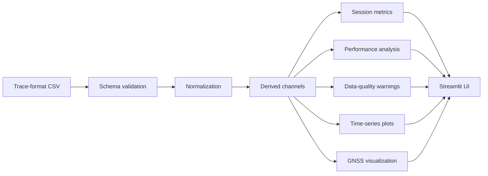

# Trace Studio

> Offline telemetry analysis application for the Trace Ecosystem.

[](https://www.python.org/)
[](https://streamlit.io/)
[](https://plotly.com/)
[](LICENSE)

Trace Studio is a Python application for importing, validating, processing, and visualizing telemetry datasets in the format designed for the Trace embedded data logger.

It was created as the offline analysis side of the Trace Ecosystem and provides dashboards, synchronized plots, GNSS visualization, derived metrics, performance-oriented analysis, and data-quality diagnostics.

## Project status

Trace Studio is a **software prototype**. Its main analysis pipeline and interface were implemented and an automated test suite was created for core processing functions.

Because the companion Trace hardware was not validated end-to-end on the target vehicle, Trace Studio was not validated against a complete production-like dataset acquired by a fully deployed Trace unit. Its behaviour should therefore be understood as that of an engineering analysis prototype rather than a validated automotive-analysis product.

## Development approach and authorship

Trace Studio was developed with **heavy use of AI-assisted coding**.

The author defined the original problem, desired user workflow, functional requirements, expected behaviours, telemetry quantities of interest, and many of the domain-level constraints. AI tools were used extensively to:

- propose software structures and implementation approaches;
- generate a large share of the Python code;
- refactor modules;
- produce utility functions and UI code;
- review the assembled codebase;
- assist with debugging and test creation.

The author generally acted as **project owner and technical director rather than as the primary manual code author**: specifying what the application should do, integrating generated components, evaluating outputs, and making technical choices when alternatives materially affected the system.

This repository is therefore best read as documentation of an AI-assisted engineering workflow applied to telemetry analysis, not as evidence of fully manual implementation of the complete Python codebase.

## Processing architecture


```mermaid
flowchart LR
    CSV[Trace-format CSV] --> VALIDATION[Schema validation]
    VALIDATION --> NORMALIZATION[Normalization]
    NORMALIZATION --> DERIVED[Derived channels]
    DERIVED --> METRICS[Session metrics]
    DERIVED --> PERFORMANCE[Performance analysis]
    DERIVED --> WARNINGS[Data-quality warnings]
    DERIVED --> CHARTS[Time-series plots]
    DERIVED --> MAP[GNSS visualization]
    METRICS --> UI[Streamlit UI]
    PERFORMANCE --> UI
    WARNINGS --> UI
    CHARTS --> UI
    MAP --> UI
```

The codebase separates ingestion, transformation, analysis, and visualization into different modules.

```text
trace_studio/
├── app.py
├── config.py
├── schema.py
├── importer.py
├── processing.py
├── metrics.py
├── performance.py
├── warnings.py
├── charts.py
├── map_view.py
├── cursor.py
├── ui.py
├── theme.py
└── __init__.py
```

## Main features

### Validation and normalization

The application checks imported datasets for issues such as:

- missing columns;
- invalid timestamps;
- missing data;
- sampling gaps;
- GNSS availability problems;
- synchronization-quality degradation.

It then normalizes units and timestamps before downstream analysis.

### Derived channels

The processing pipeline can derive quantities such as:

- session-relative time;
- speed in SI units;
- travelled distance;
- sample interval;
- longitudinal and lateral acceleration;
- filtered acceleration;
- jerk;
- path curvature;
- estimated curve radius.

### Interactive analysis

Implemented views include:

- session overview metrics;
- synchronized time-series charts;
- GNSS route maps;
- raw/processed data inspection;
- warning and diagnostic panels;
- friction-circle visualization;
- acceleration and braking metrics;
- threshold-based analysis.

## Installation

```bash
git clone https://github.com/mdmmt05/Trace-Studio.git
cd Trace-Studio
python -m venv .venv
```

Activate the environment, then:

```bash
pip install -r requirements.txt
streamlit run app.py
```

Main dependencies include:

- Streamlit
- pandas
- NumPy
- Plotly
- Folium
- streamlit-folium

## Expected input

Trace Studio is designed around the CSV schema defined for Trace, including channels from:

- GNSS;
- IMU;
- OBD-II;
- monotonic and UTC timestamps;
- source-age and synchronization-quality metadata.

Additional columns are preserved where possible.

## Testing

Run:

```bash
python -m pytest tests/ -v
```

The test suite focuses primarily on:

- CSV validation;
- normalization;
- metric generation;
- processing-pipeline correctness.

Passing software tests should not be confused with validation of the full Trace hardware-to-analysis chain.

## Known limitations

- no map matching;
- raw GNSS coordinates only;
- distance estimation based on numerical integration / Haversine methods;
- single-session analysis;
- no persistent session database;
- no automated report generation;
- no end-to-end validation with a fully deployed Trace hardware system.

## Repository purpose

Trace Studio is retained as a documented software prototype and as part of the development history of the Trace Ecosystem. It demonstrates the definition of telemetry-analysis requirements, data-processing workflows, and interactive engineering tools developed through an AI-assisted implementation process.

## License

MIT License. See `LICENSE`.
